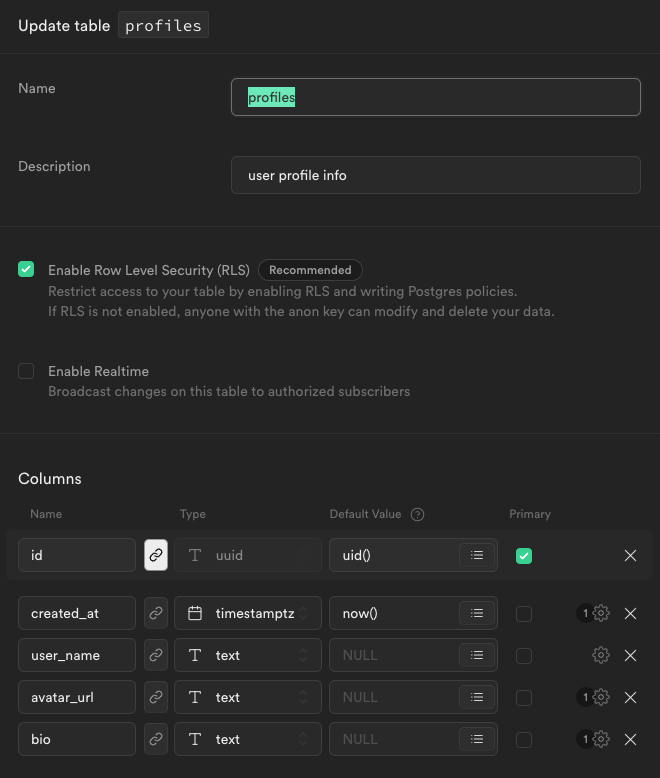

# Finish User Profile

User profiles

See [demo app](https://alchemycodelab.github.io/solutions-web/user-auth/) (My Profile and Users), you will need to create an account.

## Setup

Use [this template](https://github.com/alchemycodelab/web-finish-user-profile) for this deliverable.

1. Supabase
    1. Make new project
    1. From "auth>settings>email", turn off email confirmations and save
    1. From "settings > api", copy URL and Key into `fetch-utils.js`

Use the information below to guide you:

-   Finish Steps
-   Work Incrementally
-   Rubric

## Finish Steps

### Part A: Create profile

Enable user profile creation:

-   Create supabase `profiles` table, see schema below (leave RLS off!)
-   In `fetch-utils` implement updateProfile
-   In `/profile/profile.js`, implement profile creation in form submit

> Since we know a user can have one and only one profile row, we can use supabase [upsert](https://supabase.com/docs/reference/javascript/upsert) to either insert or update the row. Because of our policy and row default value for that tables id column, we don't have to explicitly add a WHERE criteria (`eq` or `match`)

### Part B: Update profile

-   In `fetch-utils` implement `getProfile(id)`
-   In `/profile/profile.js`, implement getting user, fetching profile by user id, and display in form

### Part D: Enable RLS

In Supabase for the `profiles` table, enable RLS and test the application (see below for policies)

### STRETCH Part D: Show all users

-   In `fetch-utils` implement `getProfiles`
-   In `render-utils.js` conditionally add a class if profile belongs to user
-   In `/users/users.js` fetch and display the list of users

## Database and Policy Schemas

Notice that the id column is linked to the `users.id` table and column, and that it defaults to `uid()`, meaning the calling users id.

Add a policy for select, insert, and update:

| setting      | value                                 |
| ------------ | ------------------------------------- |
| policy name  | Enable select for authenticated users |
| operation    | SELECT                                |
| target roles | authenticated                         |
| USING        | true                                  |

| setting      | value                                    |
| ------------ | ---------------------------------------- |
| policy name  | Enable insert for users based on user_id |
| operation    | INSERT                                   |
| target roles | authenticated                            |
| WITH         | auth.uid() = id                          |

| setting      | value                                    |
| ------------ | ---------------------------------------- |
| policy name  | Enable update for users based on user_id |
| operation    | UPDATE                                   |
| target roles | authenticated                            |
| USING        | auth.uid() = id                          |
| WITH         | auth.uid() = id                          |

## Rubric

The following is required for your assignment to be graded:

-   PR open from `dev` to `main`
-   PR Passes CI (lint)
-   PR preview on netlify

| Commit with...      |  20 |
| :------------------ | --: |
| Create Profile      |   9 |
| Update Profile      |   6 |
| RLS Policies        |   5 |
| STRETCH: Users List |   4 |
